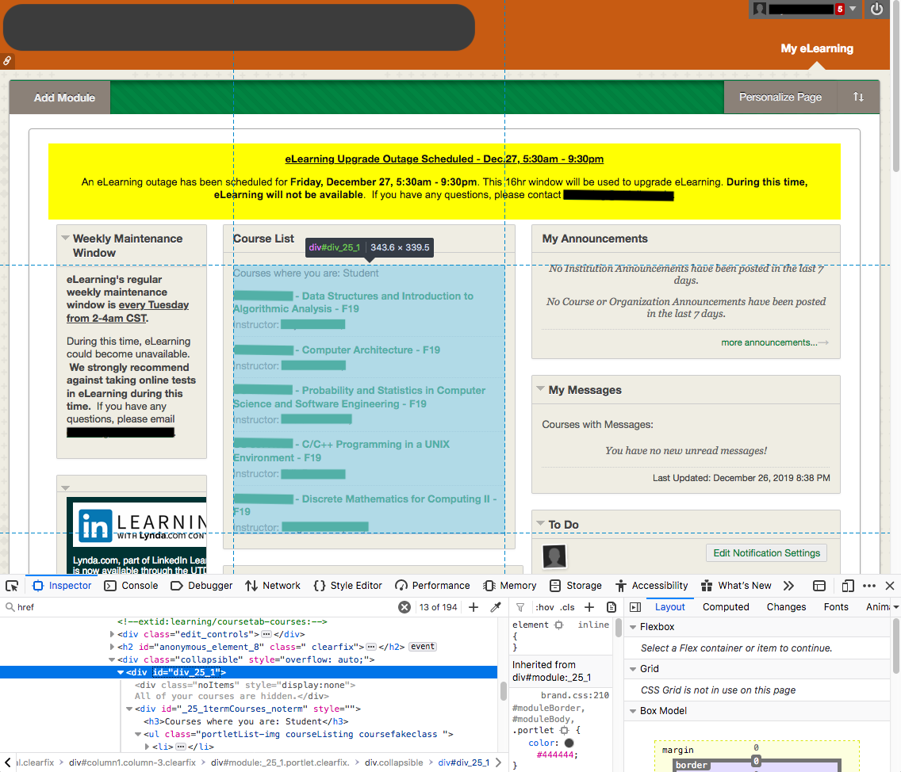
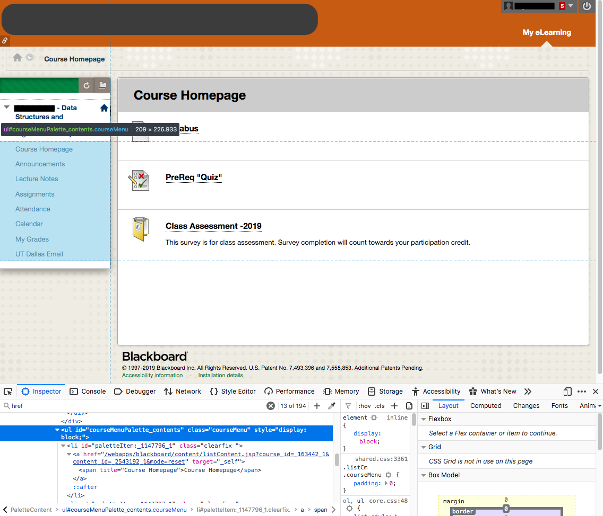

# Blackboard Duster
A scraper script for Blackboard, built with python, selenium, and the requests library. It downloads files from your courses, and sorts them neatly into folders.

## Requirements
- Python 3
- [Selenium](https://selenium.dev/selenium/docs/api/py/index.html) for python

  `pip install selenium`

- The [requests library](https://2.python-requests.org/en/master/)

  `pip install requests`

- The WebDriver for your browser - make sure its version matches your browser version!
   - [Firefox WebDriver](https://github.com/mozilla/geckodriver)

      macOS users with homebrew can use `brew install geckodriver`

   - [Chrome WebDriver](https://sites.google.com/a/chromium.org/chromedriver/)

      macOS users with homebrew can use `brew cask install chromedriver`


# Usage
If you are using __Firefox__, the easiest way to get started is with
```bash
python blackboard-duster.py "www.myschool.edu/blackboard"
```
where `www.myschool.edu/blackboard` is the URL for your school's Blackboard instance. Firefox will launch and load the page. The script will wait for you to reach the homepage.

To use __Google Chrome__, use the `-w chrome` option:
```bash
python blackboard-duster.py "www.myschool.edu/blackboard" -w chrome
```

To use a __Chromium-based__ browser, use both `-w chrome` and `-b` with the path to your browser's executable:
```bash
python blackboard-duster.py "www.myschool.edu/blackboard" -w chrome -b "/Applications/Brave Browser.app/Contents/MacOS/Brave Browser"
```
No other browsers are currently supported.

## How it works
When it first runs, the script waits for the Blackboard home page to appear, so you can sign in or even navagate to Blackboard if needed. After you reach the home page, it visits each course page, downloading files. Each link is highlighted with a box to indicate how the download went:
- <b style="border:1px dotted magenta">small dotted magenta border:</b> pending download
- <b style="border:4px solid green">solid green border:</b> successful download
- <b style="border:4px solid blue">solid blue border:</b> a newer version was successfuly downloaded
- <b style="border:4px dashed cyan">dashed cyan border:</b> file was downloaded previously, and there is no newer version
- <b style="border:4px dotted red">dotted red border:</b> file collision - there is a file in the way that is not recorded in the download history. If you know this is the right file (for instance, if you downloaded it manually earlier), you can ignore this. If it bothers you, delete or move the file.

By default downloads are saved in your working directory, but the `-s <DIRECTORY PATH>` option lets you change that.
```bash
python blackboard-duster.py "www.myschool.edu/blackboard" -s "/Users/me/school"
```
The path is evaluated using `os.path.abspath`, so it can be absolute or relative to your working directory.

A history of downloads will be created at `<DOWNLOAD PATH>/BlackboardDuster.json`. Future runs will use the history to check for updates and already-downloaded files. Moving, renaming, or modifying files will not affect the download history. This helps a lot if you disagree with how your professor has things organized. If you need to change where the history is saved/loaded from, use the `--historypath` option.
```bash
python blackboard-duster.py "www.myschool.edu/blackboard" --historypath "/Users/me/far/far/away/onion.json"
```
# Troubleshooting
### "The script does not wait long enough for the pages to load!"
Use the `--delay <#>` option, which sets a delay multiplier. The example below will give pages twice as long as normal for pages to load.
```bash
python blackboard-duster.py "www.myschool.edu/blackboard" --delay 2
```

### "The cookie notice never goes away!"
This actually isn't a problem, just an irritation. Because the script uses URLs to navagate, it never needs to click on anything (except the cookie notice). The entire page is accessible to Selenium even if it can't _click_ on anything.

### "The script says there are no courses, but I can see them on the home page!"
Your course list might be using a different css tag, and you will need to change the [css selector](https://saucelabs.com/resources/articles/selenium-tips-css-selectors) in the code. The `get_courses_info()` function looks for the course list; replace every instance of `div#div_25_1` (there are 2) with your list's selector. Both [Firefox](https://developer.mozilla.org/en-US/docs/Tools/Page_Inspector) and [Chrome](https://developers.google.com/web/tools/chrome-devtools/) have built in page inspectors. Highlight __this__ element:


### "The script can't find the navpane!"
This is similar to the course list problem. The `get_navpane_info()` function handles the navpane; replace every instance of `ul#courseMenuPalette_contents` (there are 2) with your navpane's selector. Highlight __this__ element; you may need to make the page wider to see it:


### "My problem isn't on this list!"
That is a problem, isn't it! Open an issue or send me a message, and I'll get back to you as soon as I can.
